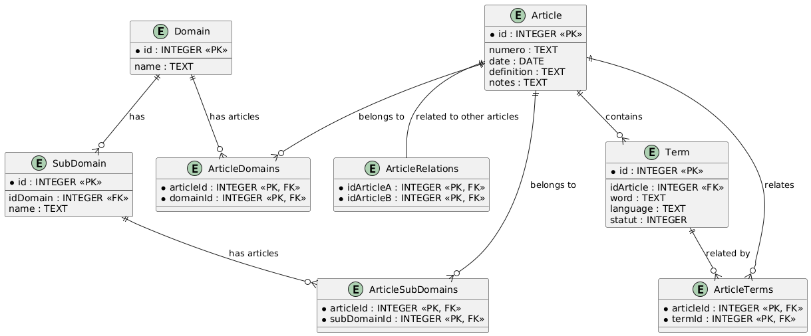

# France Terme Dataset (SQLite DB)

This repository is dedicated to storing the **France Terme** dataset in the form of an SQLite database. The dataset is structured to support the organization and management of French terminology, including its domains, subdomains, and related articles. The data model is specifically designed to maintain articles, terms, and their relationships to various domains.

## Database Structure

The following tables are used in the database:



### Domain Table
```sql
CREATE TABLE IF NOT EXISTS Domain (
    id INTEGER PRIMARY KEY,
    name TEXT NOT NULL
);
```
- **id**: The unique identifier for the domain.
- **name**: The name of the domain.

### SubDomain Table
```sql
CREATE TABLE IF NOT EXISTS SubDomain (
    id INTEGER PRIMARY KEY,
    idDomain INTEGER NOT NULL,
    name TEXT NOT NULL,
    FOREIGN KEY (idDomain) REFERENCES Domain(id)
);
```
- **id**: The unique identifier for the subdomain.
- **idDomain**: The foreign key linking to the `Domain` table.
- **name**: The name of the subdomain.

### Article Table
```sql
CREATE TABLE IF NOT EXISTS Article (
    id INTEGER PRIMARY KEY,
    numero TEXT NOT NULL,
    date DATE NOT NULL,
    definition TEXT,
    notes TEXT
);
```
- **id**: The unique identifier for the article.
- **numero**: The reference number of the article.
- **date**: The date the article was published.
- **definition**: The definition provided in the article.
- **notes**: Any additional notes or comments related to the article.

### Term Table
```sql
CREATE TABLE IF NOT EXISTS Term (
    id INTEGER PRIMARY KEY,
    idArticle INTEGER NOT NULL,
    word TEXT NOT NULL,
    language TEXT NOT NULL,
    statut INTEGER,
    FOREIGN KEY (idArticle) REFERENCES Article(id)
);
```
- **id**: The unique identifier for the term.
- **idArticle**: The foreign key linking to the `Article` table.
- **word**: The term in French (or another language).
- **language**: The language of the term (e.g., French).
- **statut**: The status of the term.

### ArticleTerms Table
```sql
CREATE TABLE IF NOT EXISTS ArticleTerms (
    articleId INTEGER NOT NULL,
    termId INTEGER NOT NULL,
    PRIMARY KEY (articleId, termId),
    FOREIGN KEY (articleId) REFERENCES Article(id),
    FOREIGN KEY (termId) REFERENCES Term(id)
);
```
- **articleId**: The foreign key linking to the `Article` table.
- **termId**: The foreign key linking to the `Term` table.

### ArticleDomains Table
```sql
CREATE TABLE IF NOT EXISTS ArticleDomains (
    articleId INTEGER NOT NULL,
    domainId INTEGER NOT NULL,
    PRIMARY KEY (articleId, domainId),
    FOREIGN KEY (articleId) REFERENCES Article(id),
    FOREIGN KEY (domainId) REFERENCES Domain(id)
);
```
- **articleId**: The foreign key linking to the `Article` table.
- **domainId**: The foreign key linking to the `Domain` table.

### ArticleSubDomains Table
```sql
CREATE TABLE IF NOT EXISTS ArticleSubDomains (
    articleId INTEGER NOT NULL,
    subDomainId INTEGER NOT NULL,
    PRIMARY KEY (articleId, subDomainId),
    FOREIGN KEY (articleId) REFERENCES Article(id),
    FOREIGN KEY (subDomainId) REFERENCES SubDomain(id)
);
```
- **articleId**: The foreign key linking to the `Article` table.
- **subDomainId**: The foreign key linking to the `SubDomain` table.

### ArticleRelations Table
```sql
CREATE TABLE IF NOT EXISTS ArticleRelations (
    idArticleA INTEGER NOT NULL,
    idArticleB INTEGER NOT NULL,
    PRIMARY KEY (idArticleA, idArticleB),
    FOREIGN KEY (idArticleA) REFERENCES Article(id),
    FOREIGN KEY (idArticleB) REFERENCES Article(id)
);
```
- **idArticleA**: The foreign key linking to the first article.
- **idArticleB**: The foreign key linking to the related article.

## Related Repositories

- **Repository to build the dataset**: [France-Termes-Parser](https://github.com/FlorealRISSO/France-Termes-Parser).
- **Repository for the app using this database**: [France-Termes-v2](https://github.com/FlorealRISSO/France-Termes-v2).

Feel free to explore the data and integrate it into applications requiring French terminology resources!
